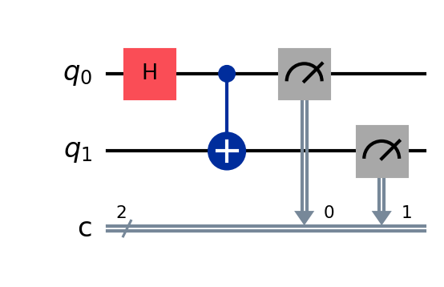

#  Quantum Operations (Gates) in Qiskit

Quantum gates are the building blocks of quantum circuits. They manipulate the state of qubits and form the basis of quantum algorithms.

In Qiskit, operations are applied as methods on a `QuantumCircuit` object.

---

## 🧱 1. Single-Qubit Gates

These gates act on one qubit.

###  Hadamard Gate (`H`)
Creates a superposition:
```python
qc.h(0)

#Results 
|0⟩ ⟶ (|0⟩ + |1⟩) / √2
|1⟩ ⟶ (|0⟩ - |1⟩) / √2


### Pauli Gates
X gate: Flips the qubit like a NOT gate.
```python
qc.x(0)


Y gate: Rotates qubit around Y-axis of Bloch sphere.
```python
qc.y(0)


Z gate: Applies a phase flip.
```python
qc.z(0)


### Identity Gate (I)
Does nothing but is useful for circuit structure:
```python
qc.i(0)

###  Phase Gates
S and T gates add phase:
S gate: Phase of π/2

```python
qc.s(0)


T gate: Phase of π/4
```python
qc.t(0)


You can also apply their inverse:
```python
qc.sdg(0)
qc.tdg(0)

### Rotation Gates
These rotate qubits on the Bloch sphere.
Around X-axis:
```python
qc.rx(theta, 0)

Around Y-axis:
```python
qc.ry(theta, 0)

Around Z-axis:
```python
qc.rz(theta, 0)


You can also use the universal gate:
```python
qc.u(theta, phi, lambda, qubit)


### Multi-Qubit Gates
 CNOT Gate (CX)
Conditional NOT: Flips target if control is 1.
```python
qc.cx(control, target)

Toffoli Gate (CCX)
A 3-qubit gate (controlled-controlled-X):
```python
qc.ccx(control1, control2, target)

Swap Gate
Swaps the state between two qubits:
```python
qc.swap(0, 1)

### Measurement: 
Measure a qubit and store the result in a classical bit:
```python
qc.measure(qubit, classical_bit)
Example:
```python
qc.measure(0, 0)


**Example: Putting it all together**


from qiskit import QuantumCircuit

qc = QuantumCircuit(2, 2)
qc.h(0)           # Superposition
qc.cx(0, 1)       # Entanglement
qc.measure(0, 0)  # Measurement
qc.measure(1, 1)

qc.draw('mpl')    # Visualize


## 🖼️ Visualization of the Circuit


